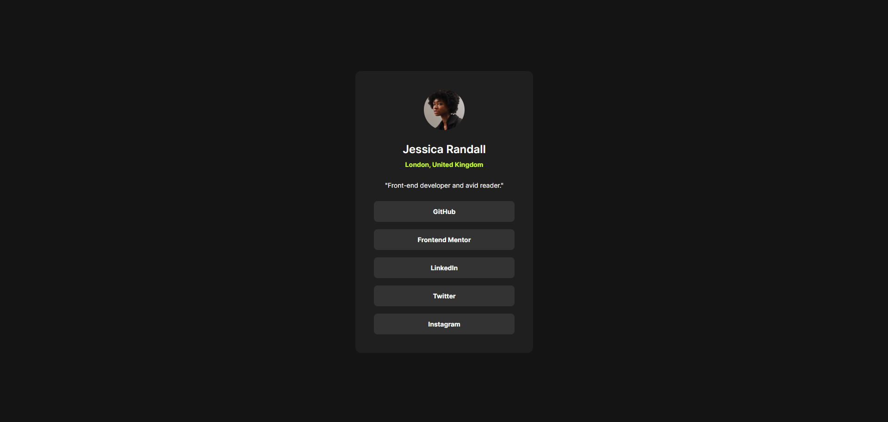
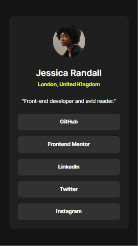

# Frontend Mentor - Social links profile solution

This is a solution to the Social links profile challenge on Frontend Mentor. Frontend Mentor challenges help you improve your coding skills by building realistic projects.

## Table of contents

* [Overview](#overview)
* [The challenge](#the-challenge)
* [Screenshot](#screenshot)
* [Links](#links)
* [My process](#my-process)
  * [Built with](#built-with)
  * [What I learned](#what-i-learned)
  * [Continued development](#continued-development)
  * [Useful resources](#useful-resources)
  * [AI Collaboration](#ai-collaboration)
* [Author](#author)

## Overview

### The challenge

Users should be able to:

* View the focus and hover states of all interactive elements on the page

### Screenshot

### Links

* Solution URL: [Click here](https://www.frontendmentor.io/solutions/social-links-profile-main-NNrxVfYZcH)
* Live Site URL: [Click here](https://israel-monteiro.github.io/)

## My process

### Built with

* Semantic HTML5 markup
* CSS custom properties
* Flexbox
* Responsive design with media queries

### What I learned

While developing this project, I practiced several important front-end concepts:

* Structuring the page using **semantic HTML elements**
* Using **Flexbox** to center the card and organize the layout
* Creating **reusable CSS variables** for colors, typography, and spacing
* Implementing **focus states** for interactive elements
* Improving accessibility using meaningful **alt text**

### Continued development

In future projects, I want to continue improving my skills with **Flexbox** and responsive layouts. While working on this challenge, I focused on building a clean and organized layout, but I still want to explore more complex layouts and component structures.

I also plan to continue improving the organization of my **CSS architecture**, making my styles easier to maintain and scale as projects grow.

By continuing to build projects like this, I hope to strengthen my knowledge of **responsive design and user interface layout techniques**.

### Useful resources

* [MDN](https://developer.mozilla.org/) - Helped me better understand how to properly use some HTML and CSS features used in this project.

### AI Collaboration

During the development of this project, I used AI tools to assist with some parts of the process.

**Tools used:**

* ChatGPT

**How I used them:**

* To clarify questions related to HTML and CSS behavior
* To get suggestions for improving layout structure and responsiveness
* To review parts of the CSS and simplify the code

**What worked well:**

The tool was useful for quickly clarifying doubts and suggesting improvements to the layout structure and responsive behavior.

**What could be improved:**

Some suggestions required adjustments to better match the design requirements and the coding style used in the project.

## Author

* Frontend Mentor - [@israel-monteiro](https://www.frontendmentor.io/profile/israel-monteiro)
